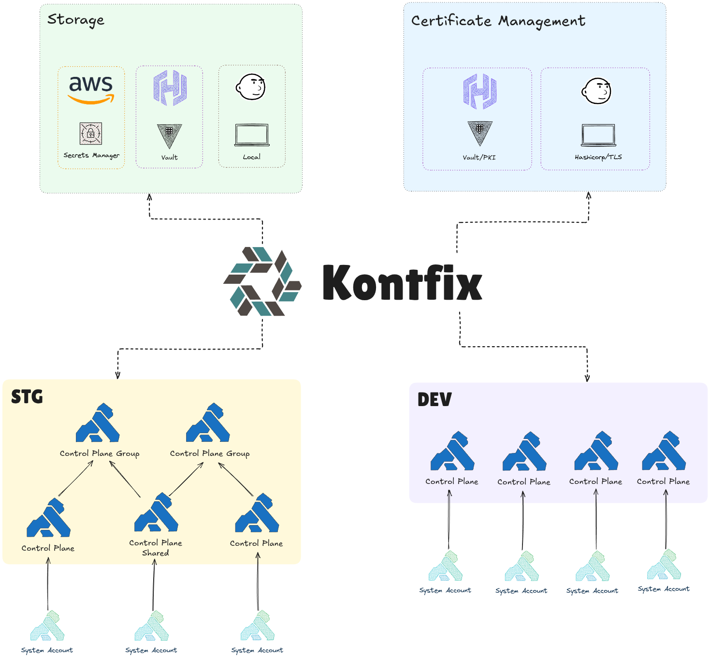

# Kontfix

Kontfix is an opinionated framework for managing Kong Control Planes on Konnect powered by Nix ([terranix](https://github.com/terranix/terranix)). It leverages Nix modules to dynamically generate Terraform resources for managing control planes, system accounts, and client certificate lifecycles.

## Features

- **Declarative Configuration**: Define Kong Control Plane setups declaratively with minimal configuration.
- **Reproducibility**: Achieve consistent configurations across multiple region and environments.
- **Flexibility**: Support different configurations for each control planes while providing sensible defaults.
- **Integration**: Seamlessly integrate with CI/CD pipelines for Terraform workflows.

## Getting Started

### Prerequisites

- [Nix](https://nixos.org/download.html) installed on your system.
- Basic understanding of Nix and Kong Control Planes.

## License

This project is licensed under the [GPL-3.0 license](LICENSE).
